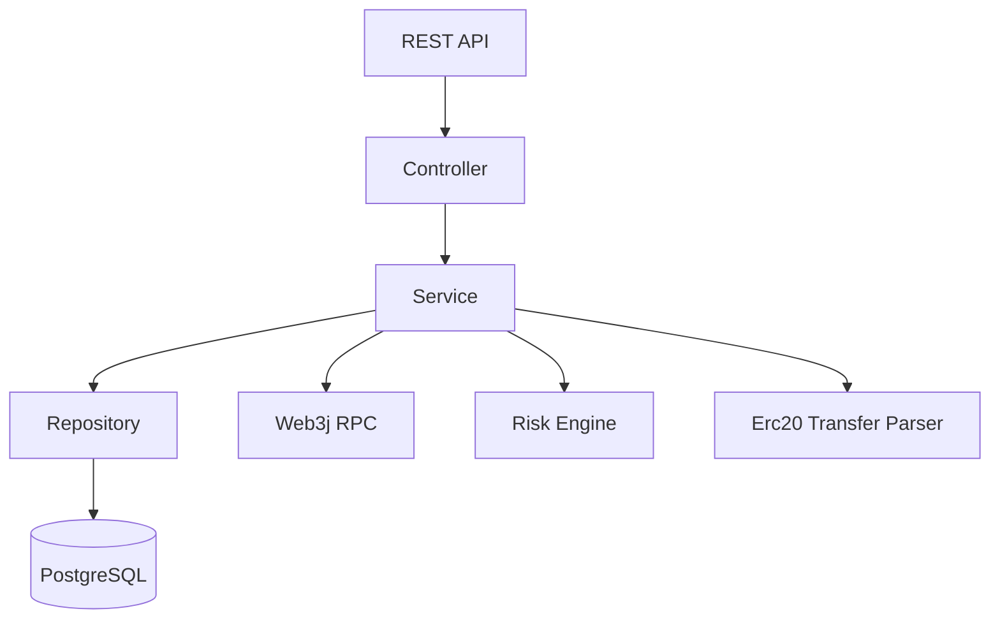

# 系统架构

项目采用清晰的单体分层结构，不引入 Spring Cloud。Controller 只负责 HTTP 入参和出参，核心逻辑放在 Service，数据访问放在 Repository，数据库对象和 API DTO 分离。

RPC 是区块链节点暴露的远程调用接口。后端通过 RPC 获取最新区块高度、区块交易和日志事件。mock 模式用于本地演示，不依赖真实 RPC；rpc 模式用于连接测试网。

Redis 当前作为缓存能力预留，后续可缓存热门地址交易列表、黑名单地址和链配置。
